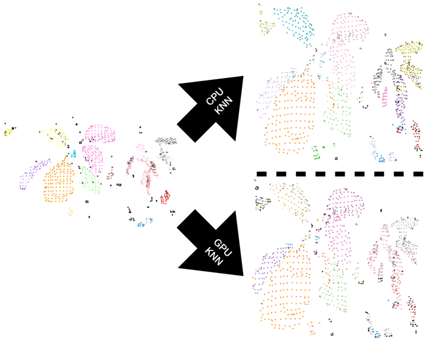

# GPUaccelOpen3D

This repository uses Numba CUDA to accelerate algorithms for point clouds generated via Open3D.

## Script Folder Structure

The project requires both [Open3D](http://www.open3d.org) and [Numba](https://numba.pydata.org) for full operation. However, the project is structured such that the point cloud visualization is separate from the GPU code to simplify dependencies. The software is split into the following python scripts:

- `libopen3d`: custom wrapper class around the Open3D library to open point cloud and extract the data as a NumPy array.
- `libfileio`: simple wrapper class to help with generating pickle and CSV files.
- `libtimer`: simple wrapper class to help with timing algorithm performance
- `runpointcloud`: a multipurpose tool for converting point clouds to pickled NumPy arrays and visualizing the point cloud data. As part of this process, Open3D's DBSCAN algorithm is used to label the points in the point cloud for the KNN classifier. This tool requires Open3D, but not Numba.
- `runknn`: a class that implements the KNN algorithm on the CPU and GPU. Run this file to time processing. This tool requires Numba, but not Open3D.
- `runransac`: a class that implements the RANSAC algorithm on the CPU and GPU. Run this file to time processing. This tool requires Numba, but not Open3D.

## Implemented Algorithms

### K-Nearest Neighbors (KNN)

The KNN algorithm provides a label $Y$ to an unlabelled feature vector $X$ by considering $X$'s relation to its $K$-nearest neighbors. This implementation uses the Euclidean distance between neighbors and an unweighted voting scheme to assign the label.

This project considers two point clouds. The first point cloud will be labeled with the DBSCAN algorithm. The second point cloud will contain the same scene, from a different angle and will be unlabeled. The KNN algorithm will then label each new point.

### RANSAC

The RANSAC algorithm fits a set of a points to a plane by randomly selecting 3 points from a point cloud and fitting them to a plane defined by $ax + by + cz + d = 0$. The remaining points are then evaluated to determine how many of those points are within a user-defined distance threshold. This process is repeated for $N$ iterations. The set of plane constants $\{a,b,c,d\}$ that encompass the most points is selected as the definition of the plane.

## References

### Numba Documentation

- [Numba Documentation](https://numba.readthedocs.io/en/stable/cuda/examples.html#matrix-multiplication)
- [Numba Supported NumPy Features](https://numba.pydata.org/numba-doc/latest/reference/numpysupported.html)
- [Numba Supported CUDA Features](https://numba.readthedocs.io/en/stable/cuda/cudapysupported.html#numpy-support)
- [Numba CUDA Atomic Operations](https://numba.pydata.org/numba-doc/latest/cuda/intrinsics.html)
- [Numba CUDA Random Number Generators](https://numba.readthedocs.io/en/stable/cuda/random.html#a-simple-example)

### Wikipedia

- [Wikipedia: KNN Algorithm](https://en.wikipedia.org/wiki/K-nearest_neighbors_algorithm)
- [Wikipedia: DBSCAN Algorithm](https://en.wikipedia.org/wiki/DBSCAN)
- [Wikipedia Radix Sort](https://en.wikipedia.org/wiki/Radix_sort)

### General

- [Point Cloud Library Documentation](http://www.open3d.org/docs/release/index.html)
- [Nvidia: 7 Things to know about Numba](https://developer.nvidia.com/blog/seven-things-numba/)
- [Including Code Blocks in LaTeX](https://www.overleaf.com/learn/latex/Code_listing)
- [NYU: Numba CUDA Matrix Multiply](https://nyu-cds.github.io/python-numba/05-cuda/)
